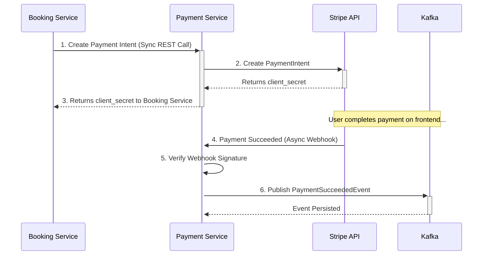

# BookTicket :: Services :: Payment Service

## Overview

The **Payment Service** is a specialized microservice that acts as a secure facade and anti-corruption layer for all interactions with our third-party payment provider, Stripe. Its sole responsibility is to handle payment intent creation and process incoming webhooks from Stripe, ensuring that payment logic is secure, isolated, and maintainable.

## Core Responsibilities

-   **Payment Intent Creation:** Provides an internal API for other services (like the Booking Service) to request the creation of a new payment session.
-   **Encapsulation of Stripe SDK:** It is the only service in the system that contains the Stripe SDK and API keys, creating a strong security boundary.
-   **Webhook Processing:** Exposes a public endpoint to receive asynchronous webhook events from Stripe (e.g., `payment_intent.succeeded`).
-   **Webhook Signature Verification:** Securely validates that incoming webhooks are genuinely from Stripe before processing them.
-   **Internal Event Publishing:** Publishes internal events (e.g., to Kafka) to notify other services of payment status changes.

## Architecture & Communication Flow

### How It Works

1.  **Isolation:** This service is the only component that communicates directly with Stripe. This isolates sensitive API keys and decouples the rest of our platform from a specific payment provider implementation.
2.  **Stateless Design:** The service does not maintain its own database of payment statuses. It acts as a pass-through and relies on Stripe as the single source of truth for all payment information.
3.  **Synchronous & Asynchronous Flow:**
    -   Payment creation is a **synchronous** REST call from the Booking Service to get an immediate payment URL/secret for the client.
    -   Payment confirmation is **asynchronous**, handled via webhooks from Stripe. This ensures reliability even if the user closes their browser or our system experiences temporary downtime.
4.  **Security:** The public webhook endpoint is secured by verifying the signature of every incoming request from Stripe, preventing spoofing attacks.

## Key Dependencies

-   **Spring Boot Starter Web:** For building the REST APIs.
-   **Stripe Java SDK (`stripe-java`):** The official library for interacting with the Stripe API.
-   **Spring Kafka:** For publishing internal events after a payment is successfully processed.
-   **Eureka Discovery Client:** To register with the service registry.

## API Endpoints

-   **Internal API (called by other services):**
    -   `POST /api/v1/payments`: Creates a new Stripe payment intent.
-   **Public API (called by Stripe):**
    -   `POST /api/v1/stripe/events`: The webhook endpoint for receiving events from Stripe.
